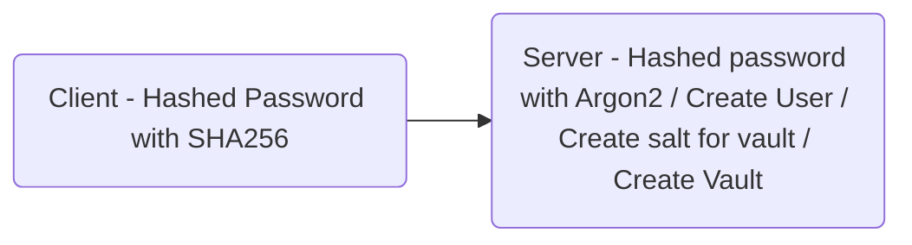
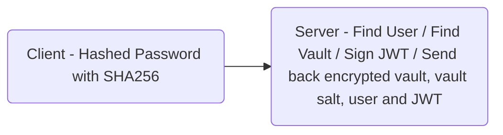

# password_vault
 
#### Technologies

- [ ] Fastify
- [ ] Typescript
- [ ] Next.js
- [ ] Chakara UI
- [ ] MongoDB

#### Algorithms used
- [ ] SHA256
- [ ] Argon2
- [ ] pbkdf2
- [ ] AES256

## Register

## Login

